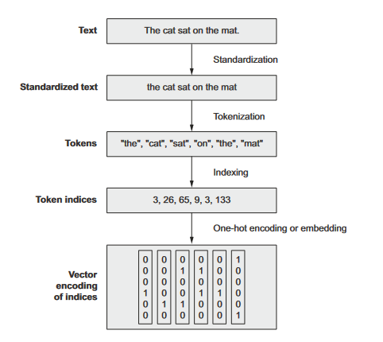
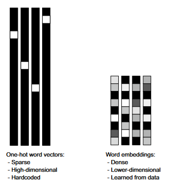
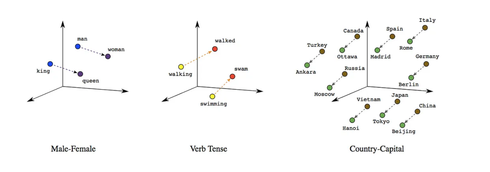
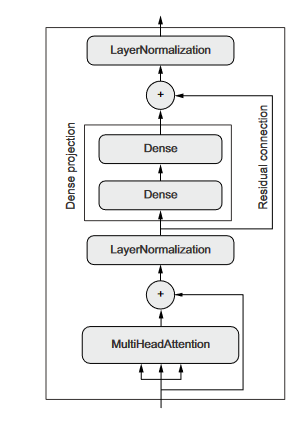
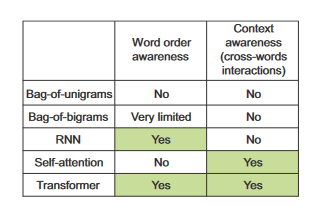

# User Review Sentiment Analysis with Keras

## Data Preprocessing
 First, I ensured that I downloaded the IMDb review dataset. The dataset contains 50,000 files divided into training and testing sets, each set containing positive and negative reviews.
 
### Creating validation dataset
 I split the training data further to create a validation set. I allocated 20% of the training data to the validation set. The directory structure looks like this:

### Converting to Tensorflow tensors
 I used the Keras text_dataset_from_directory utility to create TensorFlow datasets directly from the directory structure of the dataset. These datasets will contain TensorFlow tensors for text inputs and integer tensors for sentiment labels.

### Text Vectorization: Creating Vocabulary

 

 If we don't limit the vocabulary to the 20,000 most common words, we would end up indexing numerous terms that appear infrequently—perhaps just once or twice—         rendering them uninformative. Thus, in the realm of text classification, a vocabulary size of 20,000 is typically deemed optimal.

# Bag-of-Words: Bigram (2-gram)
The Bag-of-Words method simplifies text analysis by ignoring word order, treating each word independently. However, this approach overlooks the nuances conveyed by word combinations. Consider "hot dog" versus "hot" and "dog" separately—the former refers to a specific food item, while the latter pair merely describes temperature and an animal.

## Why Bigrams?
 To capture such nuances, N-grams, particularly bigrams, are utilized. Bigrams analyze pairs of adjacent words, retaining some contextual information. For instance,    in the sentence "The cat chased the mouse," bigrams would include {"the cat", "cat chased", "chased the", "the mouse"}.

 By incorporating bigrams, text analysis becomes more nuanced, as it retains some level of word sequence information, allowing for a richer understanding of the        text's meaning compared to single words alone.

# LSTM: Sequence modeling with word embeddings

 

 
 
 Word embeddings are dense and structured representations of words, learned from data. Similar words are close in the embedding space, and specific directions hold     meaningful distinctions. For example, "dog" and "puppy" are nearby, indicating similarity, while directions in the space represent concepts like gender or tense. For  instance, in a model, "king" - "man" + "woman" might yield "queen".

# Transformer Encoder with position aware Positional Embedding

 

 The Transformer architecture comprises two main components: an encoder for processing the input sequence and a decoder for generating output sequences. The encoder    module, originally designed for translation tasks, is versatile enough to be repurposed for text classification. By ingesting a sequence and learning to distill it    into a meaningful representation, the Transformer encoder proves to be a powerful tool for tasks like sentiment analysis.

# Model Comparison

 
 
 In comparison, the bag-of-words method achieved the highest accuracy, with a 90% accuracy rate on the test dataset, surpassing both LSTM and Transformer models,       which scored 87%.This suggests that the dataset size might not have been sufficient for LSTM and Transformer models to outperform, even though RNNs and transformers   typically dominate NLP tasks

 While some prefer Transformer-based models, the bag-of-bigrams approach, augmented with Dense layers, remains effective, especially evident in IMDB dataset            experiments. 
 
 When deciding between the two, consider the ratio of training samples to mean word count per sample. If below 1,500, opt for bag-of-bigrams for efficiency; if         above,  go for sequence models.